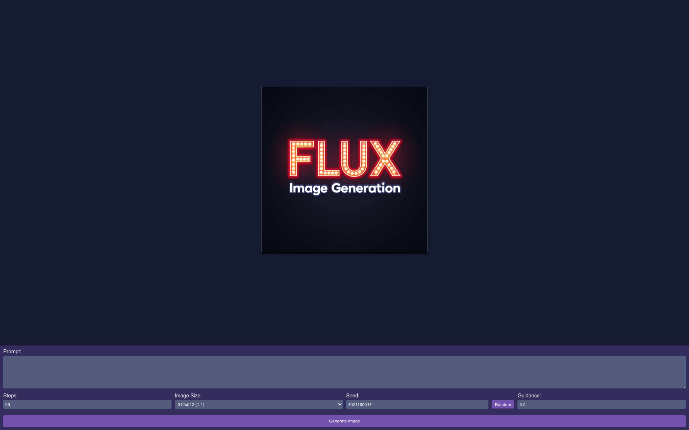
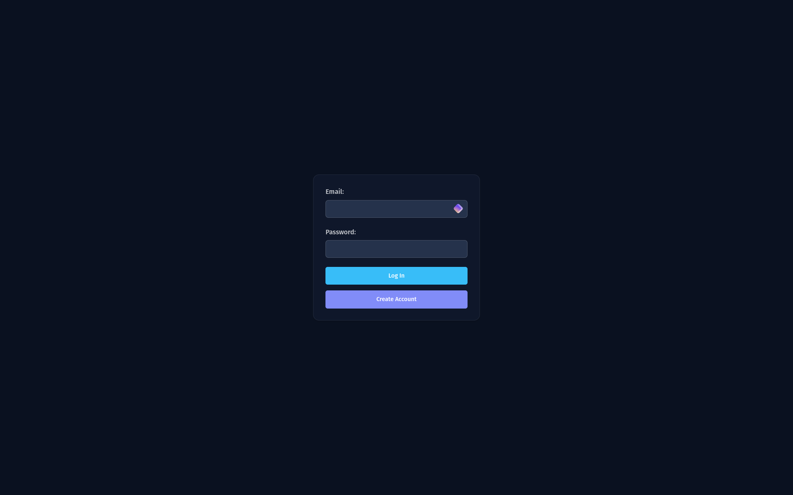
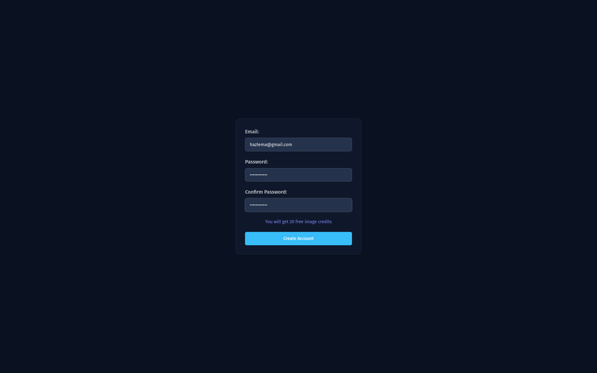

# 🎨 FAL.ai Server Written in Bun

Generate stunning images with Flux-pro using this simple frontend written in Bun! 🚀

## ✨ New Features

- 💥 Added support for Flux Schnell, Dev, Pro or Ultra
- 💥 Updated to use Flux-Pro v1.1
- 📊 SQLite database to store user info
- 🎉 Redesigned web interface
- 🔐 Login / Authentication 
- 💳 Credits System
- 🔄 Last generation settings persist

## 🚀 Quick Start

1. Edit the `/src/.env` file and add your FAL.ai key
2. Launch the server: `bun run server`
3. Access the web interface at `http://localhost:3000`

> 📝 **Note:** The server defaults to hostname `localhost` running on port `3000`. You can change this by editing `src/.env`.

## 🖼️ Preview

## 🛠️ Installation

1. Clone/Download the repo
2. Run `bun install`

Don't have the prerequisites? No worries!
- 🐰 Get Bun here: [https://bun.sh/](https://bun.sh/)
- 🔑 Get a FAL.ai key here: [https://fal.ai/](https://fal.ai/)

## 🏃‍♂️ Running the Server

1. Edit the `/src/.env` file and add your FAL.ai key
2. Launch the server: `bun run server`
3. Open your browser and navigate to: [http://localhost:3000/](http://localhost:3000/)

Happy image generating! 🎨✨